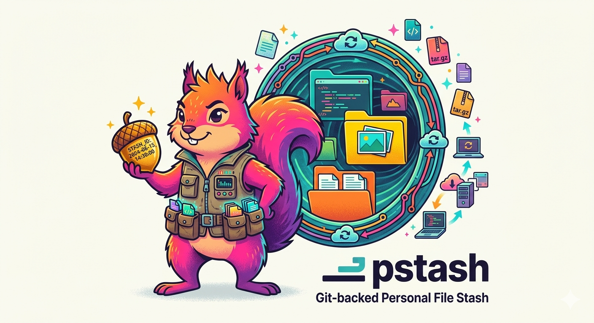

# pstash

**Git-backed personal file stash — persistent, project-categorized, multi-machine.**

<p align="center">
  
</p>

Like `git stash` but for *any* file, on *any* project, synced to a private remote.

```
pstash save "planning notes" *.md
pstash list
pstash pop
```

---

## Table of Contents

- [Overview](#overview)
- [Architecture](#architecture)
- [Installation](#installation)
- [Quick Start](#quick-start)
- [Commands](#commands)
  - [init](#init)
  - [save](#save)
  - [list](#list)
  - [pop](#pop)
  - [apply](#apply)
  - [sync](#sync)
  - [show](#show)
  - [drop](#drop)
  - [status](#status)
  - [clean](#clean)
  - [diff](#diff)
  - [config](#config)
- [Configuration](#configuration)
- [Stash ID Format](#stash-id-format)
- [Data Repo Structure](#data-repo-structure)
- [Requirements](#requirements)
- [License](#license)

---

## Overview

`pstash` solves a common problem: you have files (notes, drafts, WIP configs, snippets) that don't belong in the project's git history, but you want them:

- **Persistent** — not lost after a branch switch or system reset
- **Organized** — grouped by project, tagged, searchable
- **Multi-machine** — synced via a private git repo

### How it works

1. You have a private **data repo** (e.g. `my-personal-stash` on GitHub)
2. `pstash init` clones it to `~/.pstash` and creates `~/.pstashrc`
3. `pstash save` copies your files into `~/.pstash/<project>/<stash-id>/`
4. A `.stash.json` metadata file is written alongside the files
5. Changes are committed and (optionally) pushed to remote
6. `pstash pop` or `pstash apply` restores files back to your project

---

## Architecture

```
personal-stash-cli/     ← this package (CLI code)
    src/
      cli.ts            ← Commander.js setup + command registration
      commands/         ← one file per command
      core/
        stasher.ts      ← save() / restore() / delete() / list()
        indexer.ts      ← manages .project.json
        detector.ts     ← project name detection (git remote / dirname)
        git.ts          ← simple-git wrapper
        compressor.ts   ← tar.gz compress/decompress
      config/
        loader.ts       ← ~/.pstashrc read/write/validate
      schemas.ts        ← Zod SSoT for all types
      utils/            ← fs, format, time, validation, prompts

~/.pstashrc             ← global config (JSON)
~/.pstash/              ← local clone of your data repo
    <project>/
      .project.json     ← project index (count, size, aliases)
      <stash-id>/
        .stash.json     ← stash metadata
        <your-files>    ← stashed files (or stash.tar.gz)
```

**Two-repo design**: The CLI code (`pstash` npm package) is separate from the data repo (`my-personal-stash`). The data repo is yours — private, versioned by git, never published to npm.

---

## Installation

```bash
npm install -g pstash
```

> **Requirements**: Node 20+, Git

---

## Quick Start

### 1. Create a private data repo

Create a new empty private repo on GitHub/GitLab (e.g. `my-personal-stash`).

### 2. Initialize pstash

```bash
pstash init --remote https://github.com/you/my-personal-stash.git
```

This clones the repo to `~/.pstash` and creates `~/.pstashrc`.

### 3. Stash some files

```bash
# Stash all markdown files in current directory
pstash save "planning notes" *.md

# Stash with tags
pstash save -t docs -t wip "API design draft" docs/api.md

# Stash and remove source files
pstash save --rm "temp notes" scratch.md
```

### 4. List your stashes

```bash
pstash list
pstash list --all        # all projects
pstash list -t docs      # filter by tag
```

### 5. Restore stashes

```bash
pstash pop              # interactive selector
pstash pop 0            # newest stash
pstash apply 1          # restore without deleting
```

---

## Commands

### `init`

Initialize pstash — clone data repo and create `~/.pstashrc`.

```bash
pstash init [options]
```

| Option | Description |
|--------|-------------|
| `--remote <url>` | SSH or HTTPS URL of your data repo |
| `--path <path>` | Local path to clone to (default: `~/.pstash`) |

**Examples:**
```bash
pstash init --remote git@github.com:you/my-stash.git
pstash init --remote https://github.com/you/my-stash.git --path ~/stash
```

---

### `save`

Stash files with a message. Files are copied to the data repo, committed, and optionally pushed.

```bash
pstash save [options] <message> [files...]
```

| Option | Description |
|--------|-------------|
| `-t, --tag <tag>` | Tag (repeatable: `-t docs -t wip`) |
| `-p, --project <name>` | Override auto-detected project name |
| `--no-push` | Skip push after saving |
| `--no-compress` | Skip tar.gz compression |
| `--rm` | Remove source files after saving |
| `--keep` | Keep source files (overrides config default) |

**Examples:**
```bash
pstash save "planning notes" *.md
pstash save -t api -t draft "openapi spec" openapi.yaml
pstash save --rm "WIP code" src/experiment.ts
pstash save --no-compress "large binary" *.bin
```

**Project detection order:**
1. `--project` flag
2. Git `origin` remote → extract repo name
3. Any other git remote
4. `basename(cwd)`

---

### `list`

List stashes for the current project (or all projects).

```bash
pstash list [options]
```

| Option | Description |
|--------|-------------|
| `-a, --all` | Show stashes from all projects |
| `-p, --project <name>` | Filter by project name |
| `-t, --tag <tag>` | Filter by tag |
| `--since <timespec>` | Show stashes after date (`7d`, `2w`, `1m`, ISO) |
| `--until <timespec>` | Show stashes before date |
| `--preview` | Show first 3 lines of each file |
| `--json` | Output as JSON |

**Examples:**
```bash
pstash list
pstash list --all --tag docs
pstash list --since 7d
pstash list --json | jq '.[0].id'
```

---

### `pop`

Restore stash files to the current directory and **delete** the stash.

```bash
pstash pop [options] [index]
```

| Option | Description |
|--------|-------------|
| `--files <pattern>` | Partial restore (glob, e.g. `"*.md"`) |
| `--dest <path>` | Restore to a different directory |
| `--force` | Overwrite existing files |
| `[index]` | 0-based index (0 = newest). If omitted: interactive |

**Examples:**
```bash
pstash pop              # interactive selector
pstash pop 0            # newest stash
pstash pop 2 --dest /tmp/restore
pstash pop 0 --files "*.md"   # partial restore
```

---

### `apply`

Restore stash files **without deleting** the stash (like `git stash apply`).

```bash
pstash apply [options] [index]
```

Same options as `pop`. The stash remains in the data repo after restore.

---

### `sync`

Synchronize the stash repo with remote (pull + push).

```bash
pstash sync [options]
```

| Option | Description |
|--------|-------------|
| `--pull` | Pull only (skip push) |
| `--push` | Push only (skip pull) |

**Examples:**
```bash
pstash sync          # pull + push
pstash sync --pull   # pull only (fetch updates from other machines)
pstash sync --push   # push only (upload local stashes)
```

---

### `show`

Show details of a specific stash entry.

```bash
pstash show [options] [index]
```

| Option | Description |
|--------|-------------|
| `--files` | List stashed files only |
| `--cat` | Print file contents to stdout |
| `--json` | Output metadata as JSON |
| `[index]` | 0-based index. If omitted: interactive |

**Examples:**
```bash
pstash show             # interactive selector
pstash show 0           # newest stash
pstash show 0 --files   # list filenames
pstash show 0 --cat     # print all file contents
pstash show 0 --json    # machine-readable output
```

---

### `drop`

Delete a stash entry **without restoring** its files.

```bash
pstash drop [options] [index]
```

| Option | Description |
|--------|-------------|
| `-a, --all` | Drop all stashes in current project (double-confirm) |
| `-t, --tag <tag>` | Drop all stashes with this tag |
| `--force` | Skip confirmation prompt |
| `--dry-run` | Preview what would be deleted |
| `[index]` | 0-based index. If omitted: interactive |

**Examples:**
```bash
pstash drop 0             # drop newest (with confirmation)
pstash drop 0 --force     # drop without asking
pstash drop -t wip        # drop all WIP stashes
pstash drop --all         # drop everything (double-confirm)
pstash drop --all --dry-run   # preview only
```

---

### `status`

Show stash repository status — remote, local info, and per-project summary.

```bash
pstash status [options]
```

| Option | Description |
|--------|-------------|
| `-a, --all` | Show all projects |
| `--json` | Output as JSON |

**Example output:**
```
Remote:        git@github.com:you/my-stash.git
Local path:    /Users/you/.pstash
Unpushed:      2 commits

PROJECT       STASHES  TOTAL SIZE  LAST UPDATED
my-project        3     268 KB     2 hours ago
other-proj        1      12 KB     3 days ago
```

---

### `clean`

Remove old or filtered stash entries. **Requires at least one filter** (safety guard).

```bash
pstash clean [options]
```

| Option | Description |
|--------|-------------|
| `--older-than <timespec>` | Delete stashes older than (`30d`, `2w`, `1m`) |
| `--keep <n>` | Keep only N most recent stashes per project |
| `--tag <tag>` | Delete only stashes with this tag |
| `--all` | Delete all stashes in current project |
| `--dry-run` | Preview what would be deleted |
| `--force` | Skip confirmation |

**Examples:**
```bash
pstash clean --older-than 30d
pstash clean --keep 5
pstash clean --tag wip --dry-run
pstash clean --older-than 7d --force
```

---

### `diff`

Compare two stashes, or a stash against the current working directory.

```bash
pstash diff [options] [indexA] [indexB]
```

| Option | Description |
|--------|-------------|
| `--files <pattern>` | Limit diff to matching files |
| `[indexA]` | First stash index (default: interactive) |
| `[indexB]` | Second stash index (omit to compare with cwd) |

Built-in LCS-based diff — no external tools required.

**Examples:**
```bash
pstash diff             # interactive selection
pstash diff 0 1         # compare two stashes
pstash diff 0           # compare stash 0 with cwd
pstash diff 0 1 --files "*.ts"   # limit to TypeScript files
```

---

### `config`

View or set configuration values using dot-notation keys.

```bash
pstash config [key] [value]
```

**Examples:**
```bash
pstash config                          # list all config
pstash config defaults.autoPush        # get value
pstash config defaults.autoPush false  # set value
pstash config defaults.compression true
pstash config autoSync false
```

---

## Configuration

Config is stored at `~/.pstashrc` (JSON). Example:

```json
{
  "version": "1.0.0",
  "remote": "https://github.com/you/my-personal-stash.git",
  "localPath": "~/.pstash",
  "autoSync": true,
  "projects": {
    "scena": {
      "aliases": ["e2e-gen", "scena-cli"]
    }
  },
  "defaults": {
    "keepOnPop": false,
    "autoPush": true,
    "compression": true,
    "removeAfterSave": false
  }
}
```

### Config Keys

| Key | Type | Default | Description |
|-----|------|---------|-------------|
| `remote` | `string` | — | URL of your data repo (required) |
| `localPath` | `string` | `~/.pstash` | Local clone path |
| `autoSync` | `boolean` | `true` | Auto pull/push on operations |
| `defaults.keepOnPop` | `boolean` | `false` | If true, `pop` behaves like `apply` |
| `defaults.autoPush` | `boolean` | `true` | Push after saving |
| `defaults.compression` | `boolean` | `true` | Compress stashes as tar.gz |
| `defaults.removeAfterSave` | `boolean` | `false` | Delete source files after save |

### Project Aliases

Map alternative names to a canonical project:

```json
{
  "projects": {
    "scena": {
      "aliases": ["e2e-gen", "scena-cli"]
    }
  }
}
```

When `pstash` detects your project as `e2e-gen` (from git remote), it automatically resolves to `scena` — so all stashes are stored under one project name.

---

## Stash ID Format

Each stash has a unique ID: `YYYY-MM-DD_HH-mm_XXXX`

- `YYYY-MM-DD_HH-mm` — timestamp (UTC)
- `XXXX` — 4-character nanoid suffix (collision prevention for multi-machine use)

Example: `2026-03-12_01-05_k7x2`

---

## Data Repo Structure

```
my-personal-stash/
  scena/
    .project.json                    ← project index
    2026-03-12_01-05_k7x2/
      .stash.json                    ← metadata
      stash.tar.gz                   ← compressed files (default)
    2026-03-10_14-30_p9qr/
      .stash.json
      README.md                      ← uncompressed files
      notes.md
  other-project/
    .project.json
    2026-02-28_09-15_mnop/
      .stash.json
      stash.tar.gz
```

### `.stash.json` format

```json
{
  "id": "2026-03-12_01-05_k7x2",
  "project": "scena",
  "timestamp": "2026-03-12T01:05:00.000Z",
  "message": "planning notes for v2",
  "tags": ["docs", "planning"],
  "branch": "main",
  "commit": "abc123def456",
  "user": "gab@macmini",
  "files": [
    { "name": "README.md", "size": 1024, "hash": "sha256:a1b2c3d4e5f6" }
  ],
  "totalSize": 1024,
  "compressed": true
}
```

---

## Requirements

- **Node.js** 20+
- **Git** (must be installed and in PATH)
- A private git repository for your stash data

---

## License

MIT — see [LICENSE](./LICENSE)
